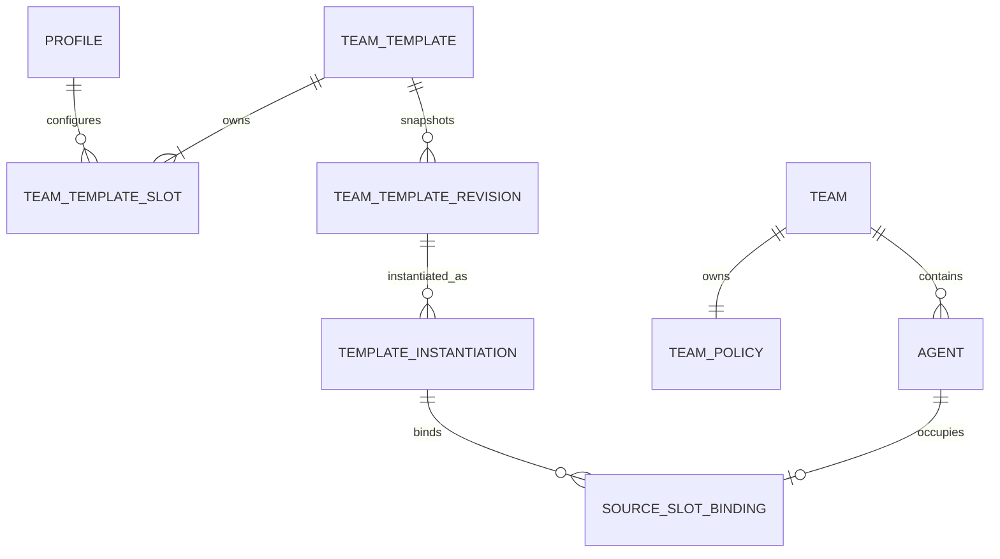

# ADR 0001: Canonical Team and Team Template domain

Status: accepted

## Decision

Bazilion exposes Teams everywhere. A Team is a live collaboration root. A Team Template is the
only reusable roster and policy definition. “Group”, “Profile Group”, detached “Harness”, and
compatibility projections are not domain concepts or public surfaces.

There is exactly one canonical Team Template roster and exactly one effective live policy per Team.
Agents have exactly one Team membership. Stable slot identity belongs to Team Templates; live Agent
identity survives moves and policy changes.

## Lifecycle

| Operation | Required contract | Result |
| --- | --- | --- |
| Spawn Agent | Team revision + explicit placement | Agent joins one Team; policy revision increments |
| Spawn Team Template | Template revision + initialize/append mode | Agents and lineage are created atomically |
| Move Agent | Source revision + destination revision + placement | Membership and both policies update atomically |
| Archive Agent | Agent identity | Membership and policy remain intact |
| Delete Agent | Team revision | Policy edges/state and Agent are removed atomically |
| Delete Team | Team revision and no members | Team root and its sole policy are removed |

## Authorization

| Boundary | Required edge(s) |
| --- | --- |
| User → Agent | Team `user → agent` |
| Agent → User | Team `agent → user` |
| Same-Team peer | Team `agent → agent` |
| Cross-Team peer | Source `agent → outside_team` and target `outside_team → agent` |
| Scheduler → Agent | Team `user → agent` |

An `approval_required` edge holds the typed attempt before its side effect. A missing edge denies.
There is one shared authorizer and no bypass path.

## Persistence and compatibility

The project is alpha and has one clean-install schema in `0001_init.sql`. No database, API, CLI,
filesystem, or URL compatibility layer is maintained. Schema changes may require deleting and
recreating `~/.bazilion`.
